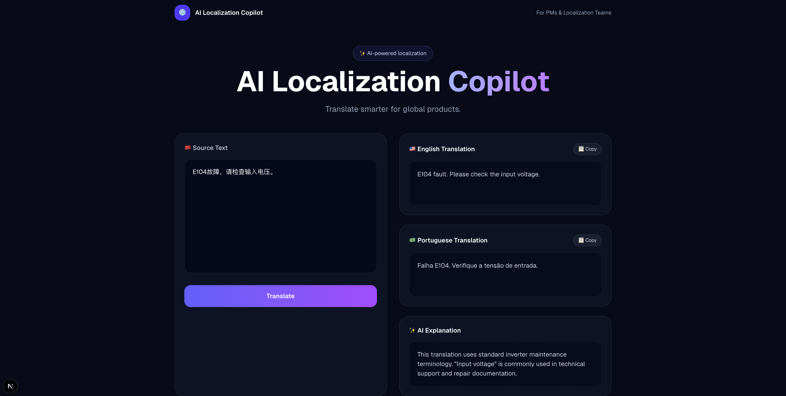

# AI Localization Copilot

An AI-powered localization assistant built with **Next.js**, **React**, and **TypeScript**, designed to help product managers and localization teams translate Chinese UI text into English and Portuguese more efficiently.

🌐 **Live Demo**

https://ai-localization-copilot.vercel.app/

---

## ✨ Features

- 🌍 Chinese → English Translation
- 🇧🇷 Chinese → Portuguese Translation
- 📋 One-click Copy
- 🤖 AI Explanation Panel (UI Prototype)
- 💻 Responsive Interface
- ⚡ Built with Next.js + React

---

## 📸 Project Preview



---

## 🛠 Tech Stack

- Next.js
- React
- TypeScript
- Tailwind CSS
- Vercel

---

## 🚀 Getting Started

Clone the repository:

```bash
git clone https://github.com/esther10169029-bot/ai-localization-copilot.git
```

Install dependencies:

```bash
npm install
```

Run locally:

```bash
npm run dev
```

Open your browser:

```
http://localhost:3000
```

---

## 📂 Project Structure

```
src/
├── app/
├── components/
│   └── LocalizationCopilot.tsx
public/
└── images/
```

---

## 🚧 Future Improvements

- Integrate OpenAI API
- AI-powered translation explanation
- Translation history
- Export translations
- More target languages
- Dark / Light mode

---

## 👩‍💻 Author

**Xingxing Wang**

Product Manager passionate about AI products, SaaS, and Global Product Experience.

GitHub:

https://github.com/esther10169029-bot

Live Demo:

https://ai-localization-copilot.vercel.app/

---

⭐ If you like this project, feel free to give it a Star!
